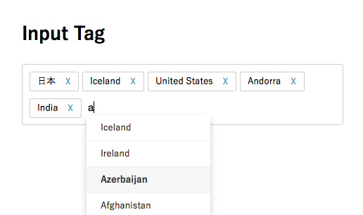

# tag-inputter
複数のタグを補完入力可能なJQueryのプラグイン。


<!--
[デモ](リンク)
-->

## 使い方
### jQueryを読み込む

```
<script src="https://ajax.googleapis.com/ajax/libs/jquery/*.*.*/jquery.min.js"></script>
<script src="https://ajax.googleapis.com/ajax/libs/jqueryui/*.*.*/jquery-ui.min.js"></script>
```

### タグ入力表示部分

```
<div id="tag_frame">
<div id="tags"></div>
<input type="text" id="tag_input">
<input type="hidden" name="skills" id="skills">
</div>
```

### 補完する内容の選択肢を配列に格納

```
<script>
var data_tags = [
"HTML",
"CSS",
"JavaScript"
];
</script>
```
   
### Input_Tagを読み込む

```
<script src="input_tag.js"></script>
```
    
## 選択されたタグについて

```
<input type="hidden" name="skills" id="skills">
```

に **カンマ区切り** で出力されます。

## LICENCE
MIT Licence.
Developed by [Yoshihisa Kaino.](https://github.com/yoshi1125hisa)
Programming language list From [Wikipedia](https://ja.wikipedia.org/wiki/%E3%83%97%E3%83%AD%E3%82%B0%E3%83%A9%E3%83%9F%E3%83%B3%E3%82%B0%E8%A8%80%E8%AA%9E%E4%B8%80%E8%A6%A7)
